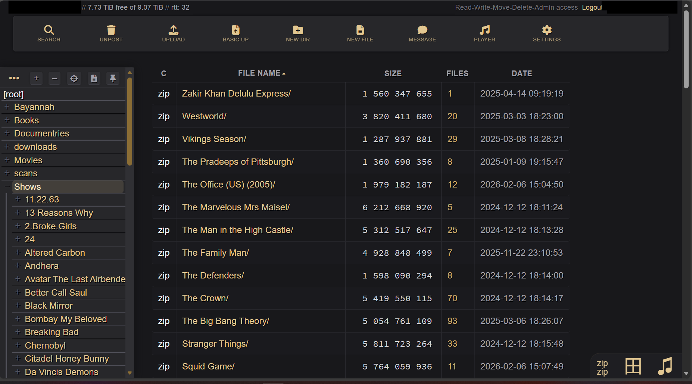
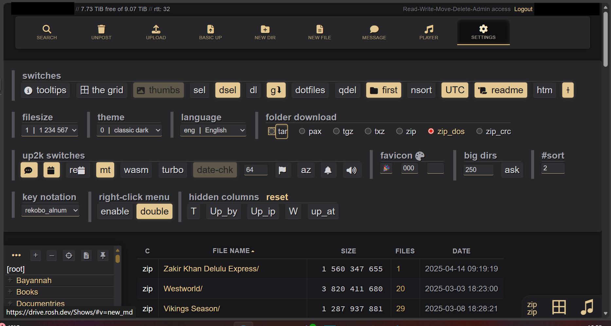
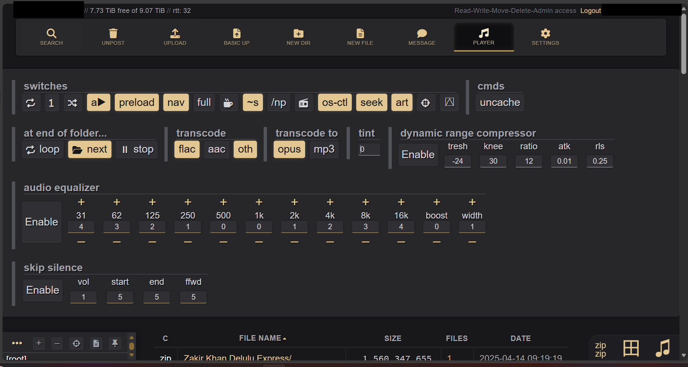

# White-Gold Theme for Copyparty

A dark, professional-looking theme for [copyparty](https://github.com/9001/copyparty) — swaps out all the emoji icons for Font Awesome, brings in a warm zinc + gold color scheme, and tidies up the layout. No original files are touched; it's all done through copyparty's built-in CSS/JS injection flags.

## Screenshots







---

## Getting Started

You just need three flags when launching copyparty:

```bash
copyparty \
  --html-head '<link rel="stylesheet" href="https://cdnjs.cloudflare.com/ajax/libs/font-awesome/6.5.1/css/all.min.css">' \
  --js-browser /path/to/contrib/themes/white-gold.js \
  --css-browser /path/to/contrib/themes/white-gold.css
```

Swap `/path/to/` with wherever you've got these files.

### Docker Compose

If you're running copyparty in Docker, drop `white-gold.css` and `white-gold.js` into your mounted config directory and add this to your copyparty config file:

```ini
[global]
  html-head: <link rel="stylesheet" href="https://cdnjs.cloudflare.com/ajax/libs/font-awesome/6.5.1/css/all.min.css">
  css-browser: /config/white-gold.css
  js-browser: /config/white-gold.js
```

Adjust `/config/` to match wherever your volume is mounted inside the container.

### What's in the box

| File | What it does |
|------|--------------|
| `white-gold.js` | Finds and replaces every emoji in the UI with a proper Font Awesome icon |
| `white-gold.css` | The color scheme, layout tweaks, and all the visual polish |

You'll also need **Font Awesome 6.5.1** — that's what the `--html-head` flag loads from the CDN.

---

## What Changed

### Icons (JS)

All the emojis scattered across the UI are replaced with Font Awesome 6 solid icons. This happens on page load and covers pretty much everything:

- **Toolbar** — search, upload, new folder, settings, etc. Each button now has a clean icon with a small text label underneath
- **Breadcrumb bar** — the tree and bread emojis are gone, replaced with proper icons
- **Sidebar controls** — target, file list, pin, hover toggles
- **Bottom bar** — share, rename, delete, cut, copy, paste, zip
- **Media player** — prev/play/pause/next, with a MutationObserver to handle the dynamic play/pause swap
- **Upload panel** — all the checkbox labels, the overwrite mode cycling button (also uses a MutationObserver), drop zones, spinner
- **Settings & player panels** — every toggle and option emoji
- **Submenu forms** — new folder, new file, message icons
- **Catch-all sweep** — a final pass over all toggle buttons and labels to grab anything that slipped through

The close button on the toolbar is also hidden since it doesn't really serve a purpose.

### Color Scheme (CSS)

Dark zinc greys for backgrounds with warm white-gold as the accent color. Think: professional but not cold.

**Gold accents** (used for links, active states, borders, focus rings):
- `#f5e6c8` — lightest, for hovers
- `#e2c792` — primary accent
- `#c9a96c` — borders and focus rings
- `#a8884d` — muted accent
- `#8a6d35` — subtle, like scrollbars

**Backgrounds** are the Tailwind zinc scale — `#09090b` at the darkest up to `#5a5a63` for muted UI elements. Text goes from `#a1a1aa` (secondary) to `#fafafa` (max contrast).

Green and red semantic colors are kept intact for success/error states.

> The tricky bit was CSS specificity — copyparty uses theme classes like `html.a`, `html.az`, etc. that override `:root` variables. We use `html#ht_brw` combined with every theme class variant to win the specificity war without resorting to `!important`.

### Focus States (CSS)

Copyparty has hardcoded `#fc0` yellow for focus outlines in `ui.css`. The theme overrides these with a warm gold `box-shadow` and `outline` that actually fits the palette.

### Toolbar (CSS)

Flexbox layout with icon-above-label column direction. Responsive — labels disappear on smaller screens, and everything compresses further on mobile. Settings button is pushed to the far right.

### Bottom Bar (CSS)

Cleaned up button styles, pill-shaped footer navigation links, subtle gold hover tints. The toggle bar gets a soft top border to separate it from content.

### File Table (CSS)

- More padding in cells so things don't feel cramped
- Uppercase column headers, slightly smaller and in a muted grey
- Subtle row separators and softer alternating row colors
- Lighter column dividers

### Sort Indicators (CSS)

The little `⌄` / `⌃` characters next to sorted columns are replaced with Font Awesome solid carets. Primary sort shows in gold, secondary in a darker gold.

### Sidebar (CSS)

- Cleaner header with a subtle bottom border
- Tree control buttons have consistent styling with hover effects
- The current folder highlight is now a subtle semi-transparent gold wash instead of a solid gold block
- `[root]` input gets a clean transparent look with a gold focus border

### README Card (CSS)

When a folder has a README, it shows up in a bordered card with rounded corners and a small "README.md" label. Keeps things tidy.

### Header Bar (CSS)

Server info and account bar are smaller and greyer — they're there if you need them but don't compete for attention. Logout link is in gold.

### Row Hover (CSS)

Hovering over a file row gives a warm-tinted background with subtle gold inset shadows. Filenames are bright white, metadata is dimmer.

### FA Icon Resets (CSS)

Copyparty's original CSS rotates `<i>` elements 45 degrees for folder-tree chevrons. Since Font Awesome also uses `<i>` tags, we reset `transform`, `border`, `background`, etc. on `.fa-solid` icons in all affected containers so they don't get mangled.

---

## Why it works this way

- **Zero modifications to copyparty source** — everything goes through `--css-browser`, `--js-browser`, and `--html-head`
- **Plain vanilla JS** — no frameworks, no build tools, just DOM manipulation on `DOMContentLoaded`
- **MutationObservers** for the bits that change dynamically (play/pause, overwrite mode)
- **One last sweep** at the end catches any stragglers the targeted replacements might have missed
- **Gold on grey** keeps things warm without being flashy — accents are only on interactive elements, backgrounds stay neutral
